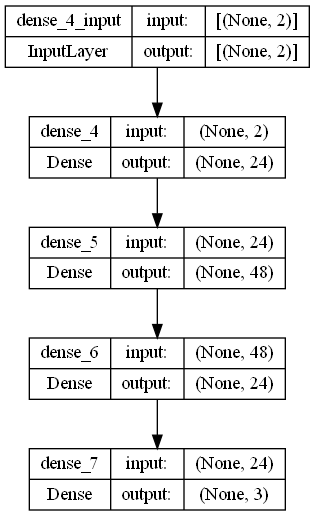

# Mountain Car Double Deep Q Network
Double deep q network implementation in OpenAI Gym's "Mountain Car" environment 

## What is OpenAI Gym's "Mountain Car" environment

The Mountain Car MDP is a deterministic MDP that consists of a car placed stochastically at the bottom of a sinusoidal valley, with the only possible actions being the accelerations that can be applied to the car in either direction. The goal of the MDP is to strategically accelerate the car to reach the goal state on top of the right hill. 

[Complete Details](https://www.gymlibrary.dev/environments/classic_control/mountain_car/)

## Double Deep Q Network
DDQN architecture

## Network
We use the following network for this problem

